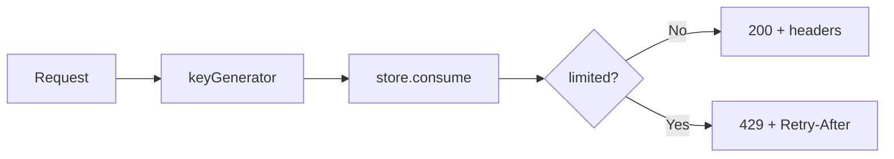
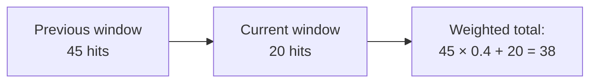
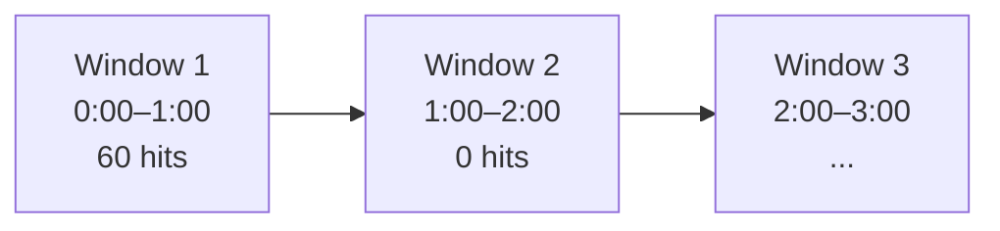
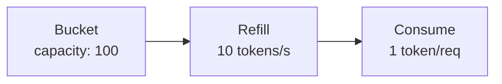

Want to try it first? **[Open the playground](/playground)** to experiment with rate limiting right in your browser.

## Installation

Install the core package:

```bash
npm install universal-rate-limit
```

Or with your preferred package manager:

```bash
pnpm add universal-rate-limit
yarn add universal-rate-limit
```

If you're using a framework, install the corresponding middleware package instead — it includes the core as a dependency:

```bash
npm install @universal-rate-limit/express
npm install @universal-rate-limit/fastify
npm install @universal-rate-limit/hono
npm install @universal-rate-limit/nextjs
```

For distributed deployments, add the Redis store:

```bash
npm install @universal-rate-limit/redis
```

## How It Works



The core flow: every request is identified by a key (default: client IP), the store tracks consumption against the chosen algorithm, and the
result includes IETF-compliant rate limit headers.

## Basic Usage

The `rateLimit` function creates a limiter that accepts a Web Standard `Request` and returns a `RateLimitResult`:

```ts
import { rateLimit } from 'universal-rate-limit';

const limiter = rateLimit({
    algorithm: { type: 'sliding-window', windowMs: 60_000 }, // 1 minute window
    limit: 60 // 60 requests per window
});

// In your request handler:
const result = await limiter(request);

if (result.limited) {
    return new Response('Too Many Requests', {
        status: 429,
        headers: result.headers
    });
}

// Continue processing...
```

## Options

All options are optional with sensible defaults:

| Option          | Type                           | Default               | Description                                                 |
| --------------- | ------------------------------ | --------------------- | ----------------------------------------------------------- |
| `limit`         | `number \| (req) => number`    | `60`                  | Max requests per window (can be async)                      |
| `algorithm`     | `AlgorithmConfig \| Algorithm` | sliding-window (60s)  | Rate limiting algorithm (config object or instance)         |
| `cost`          | `number \| (req) => number`    | `1`                   | Units to consume per request (can be async)                 |
| `headers`       | `'draft-7' \| 'draft-6'`       | `'draft-7'`           | IETF rate limit headers version                             |
| `legacyHeaders` | `boolean`                      | `false`               | Include `X-RateLimit-*` headers                             |
| `store`         | `Store`                        | `MemoryStore`         | Storage backend ([Redis](/docs/stores#redis-store), custom) |
| `keyGenerator`  | `(req) => string`              | IP-based              | Extract client identifier                                   |
| `skip`          | `(req) => boolean`             | `undefined`           | Skip rate limiting for certain requests                     |
| `handler`       | `(req, result) => Response`    | `undefined`           | Custom 429 response handler                                 |
| `message`       | `string \| object \| function` | `'Too Many Requests'` | Response body when limited                                  |
| `statusCode`    | `number`                       | `429`                 | HTTP status code when limited                               |
| `failOpen`      | `boolean`                      | `false`               | Fail open if the store errors                               |
| `prefix`        | `string`                       | `undefined`           | Namespace prefix for [multiple limiters](/docs/api#multiple-limiters) |

## Algorithms

### Sliding Window

The sliding-window algorithm provides smoother rate limiting by weighting the previous window's hits:



```ts
import { rateLimit, slidingWindow } from 'universal-rate-limit';

const limiter = rateLimit({
    algorithm: slidingWindow({ windowMs: 60_000 }),
    limit: 100
});
```

### Fixed Window

The fixed-window algorithm uses a simple counter that resets at each window boundary:



```ts
import { rateLimit, fixedWindow } from 'universal-rate-limit';

const limiter = rateLimit({
    algorithm: fixedWindow({ windowMs: 60_000 }),
    limit: 100
});
```

### Token Bucket

The token-bucket algorithm allows steady-rate traffic with burst capacity:



```ts
import { rateLimit, tokenBucket } from 'universal-rate-limit';

const limiter = rateLimit({
    limit: 100,
    algorithm: tokenBucket({ refillRate: 10 })
});
```

The `limit` option controls the bucket capacity — how many tokens the bucket holds. You can also use config objects instead of factory
functions:

```ts
const limiter = rateLimit({
    limit: 100,
    algorithm: { type: 'token-bucket', refillRate: 10 }
});
```

## Custom Key Generator

By default, the client IP is extracted from common proxy headers (`x-forwarded-for`, `x-real-ip`, `cf-connecting-ip`, `fly-client-ip`).
Override this for custom logic:

```ts
const limiter = rateLimit({
    keyGenerator: request => {
        // Rate limit by API key
        return request.headers.get('x-api-key') ?? '127.0.0.1';
    }
});
```

Use `extractClientIp` to compose the library's IP logic into a custom key:

```ts
import { rateLimit, extractClientIp } from 'universal-rate-limit';

const limiter = rateLimit({
    keyGenerator: (req) => `${getUserId(req)}:${extractClientIp(req)}`
});
```

## Dynamic Limits

The `limit` option accepts a function for per-request limits:

```ts
const limiter = rateLimit({
    limit: async request => {
        const apiKey = request.headers.get('x-api-key');
        if (apiKey === 'premium') return 1000;
        return 60;
    }
});
```

## Skip Requests

Bypass rate limiting for certain requests:

```ts
const limiter = rateLimit({
    skip: request => {
        return new URL(request.url).pathname === '/health';
    }
});
```

## Custom Response

Customize the 429 response body. A `Retry-After` header is included automatically on all 429 responses.

```ts
const limiter = rateLimit({
    message: { error: 'Rate limit exceeded' },
    statusCode: 429
});
```

Or use a handler function for full control:

```ts
const limiter = rateLimit({
    handler: (request, result) => {
        return new Response(JSON.stringify({ error: 'Too many requests', reset: result.resetTime }), {
            status: 429,
            headers: { 'Content-Type': 'application/json' }
        });
    }
});
```
