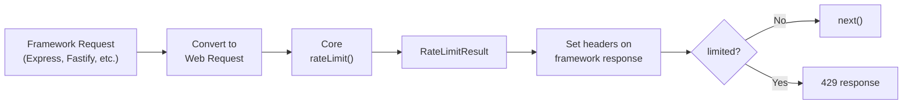

Each framework adapter is a separate package that wraps the core `rateLimit` function. All adapters accept the same `RateLimitOptions` plus framework-specific options.



## Express

```bash
npm install @universal-rate-limit/express
```

```ts
import express from 'express';
import { expressRateLimit } from '@universal-rate-limit/express';

const app = express();

// Apply to all routes
app.use(
    expressRateLimit({
        algorithm: { type: 'sliding-window', windowMs: 60_000 },
        limit: 60
    })
);

// Or apply to specific routes
app.use(
    '/api/',
    expressRateLimit({
        algorithm: { type: 'sliding-window', windowMs: 15 * 60_000 },
        limit: 100
    })
);
```

The Express adapter converts `express.Request` to a Web Standard `Request` internally, extracting headers and URL information.

## Fastify

```bash
npm install @universal-rate-limit/fastify
```

```ts
import Fastify from 'fastify';
import { fastifyRateLimit } from '@universal-rate-limit/fastify';

const fastify = Fastify();

// Register as a plugin
await fastify.register(fastifyRateLimit, {
    algorithm: { type: 'sliding-window', windowMs: 60_000 },
    limit: 60
});
```

The Fastify adapter registers an `onRequest` hook that runs before route handlers.

## Hono

```bash
npm install @universal-rate-limit/hono
```

```ts
import { Hono } from 'hono';
import { honoRateLimit } from '@universal-rate-limit/hono';

const app = new Hono();

// Apply to all routes
app.use(
    honoRateLimit({
        algorithm: { type: 'sliding-window', windowMs: 60_000 },
        limit: 60
    })
);

// Or apply to specific paths
app.use(
    '/api/*',
    honoRateLimit({
        algorithm: { type: 'sliding-window', windowMs: 15 * 60_000 },
        limit: 100
    })
);
```

The Hono adapter uses `c.req.raw` to access the native Web Standard `Request` directly — no conversion needed.

## Next.js

```bash
npm install @universal-rate-limit/nextjs
```

### App Router API Routes

Wrap route handlers with `withRateLimit`:

```ts
// app/api/hello/route.ts
import { withRateLimit } from '@universal-rate-limit/nextjs';

async function handler(request: Request) {
    return Response.json({ message: 'Hello!' });
}

export const GET = withRateLimit(handler, {
    algorithm: { type: 'sliding-window', windowMs: 60_000 },
    limit: 60
});
```

### Edge Middleware

Use `nextjsRateLimit` for Edge Middleware:

```ts
// middleware.ts
import { nextjsRateLimit } from '@universal-rate-limit/nextjs';
import { NextResponse } from 'next/server';

const limiter = nextjsRateLimit({
    algorithm: { type: 'sliding-window', windowMs: 60_000 },
    limit: 100
});

export async function middleware(request: Request) {
    const result = await limiter(request);

    if (result.limited) {
        return new NextResponse('Too Many Requests', {
            status: 429,
            headers: result.headers
        });
    }

    const response = NextResponse.next();
    for (const [key, value] of Object.entries(result.headers)) {
        response.headers.set(key, value);
    }
    return response;
}
```

## Response Headers

All middleware adapters automatically set IETF rate limit headers on every response:

### Draft-7 (default)

```
RateLimit: limit=60, remaining=59, reset=58
RateLimit-Policy: 60;w=60
```

### Draft-6

```
RateLimit-Limit: 60
RateLimit-Remaining: 59
RateLimit-Reset: 58
```

### Retry-After

When a request is rate-limited (429), a [`Retry-After`](https://www.rfc-editor.org/rfc/rfc9110#section-10.2.3) header is automatically included using the delay-seconds format:

```
Retry-After: 58
```

This is a standard HTTP header (RFC 9110 §10.2.3) that tells clients how many seconds to wait before retrying. It is included regardless of which draft version is configured.

Switch between header versions with the `headers` option:

```ts
expressRateLimit({
    headers: 'draft-6'
});
```
