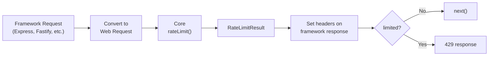

Each framework adapter is a separate package that wraps the core `rateLimit` function. All adapters accept the same `RateLimitOptions` plus
framework-specific options.


```mermaid
flowchart LR
    A["Framework Request\n(Express, Fastify, etc.)"] --> B["Convert to\nWeb Request"]
    B --> C["Core\nrateLimit()"]
    C --> D["RateLimitResult"]
    D --> E["Set headers on\nframework response"]
    E --> F{limited?}
    F -->|No| G["next()"]
    F -->|Yes| H["429 response"]
```

## Frameworks

### Express

```bash
npm install @universal-rate-limit/express
```

```ts
import express from 'express';
import { expressRateLimit } from '@universal-rate-limit/express';

const app = express();

// Apply to all routes
app.use(
    expressRateLimit({
        algorithm: { type: 'sliding-window', windowMs: 60_000 },
        limit: 60
    })
);

// Or apply to specific routes
app.use(
    '/api/',
    expressRateLimit({
        algorithm: { type: 'sliding-window', windowMs: 15 * 60_000 },
        limit: 100
    })
);
```

The Express adapter converts `express.Request` to a Web Standard `Request` internally, extracting headers and URL information.

### Fastify

```bash
npm install @universal-rate-limit/fastify
```

```ts
import Fastify from 'fastify';
import { fastifyRateLimit } from '@universal-rate-limit/fastify';

const fastify = Fastify();

// Register as a plugin
await fastify.register(fastifyRateLimit, {
    algorithm: { type: 'sliding-window', windowMs: 60_000 },
    limit: 60
});
```

The Fastify adapter registers an `onRequest` hook that runs before route handlers.

### Hono

```bash
npm install @universal-rate-limit/hono
```

```ts
import { Hono } from 'hono';
import { honoRateLimit } from '@universal-rate-limit/hono';

const app = new Hono();

// Apply to all routes
app.use(
    honoRateLimit({
        algorithm: { type: 'sliding-window', windowMs: 60_000 },
        limit: 60
    })
);

// Or apply to specific paths
app.use(
    '/api/*',
    honoRateLimit({
        algorithm: { type: 'sliding-window', windowMs: 15 * 60_000 },
        limit: 100
    })
);
```

The Hono adapter uses `c.req.raw` to access the native Web Standard `Request` directly — no conversion needed.

#### Typed Hono context

`honoRateLimit<AppEnv>()` passes `Context<AppEnv>` as the final argument to every callback. The original Web `Request` remains the first
argument, so existing Request-only callbacks continue to work. Register authentication middleware before the limiter when keys or allowances
depend on verified identity; the limiter does not authenticate callers itself.

```ts
import { Hono } from 'hono';
import { honoRateLimit } from '@universal-rate-limit/hono';

type AppEnv = {
    Variables: {
        tenantId: string;
        apiLimit: number;
    };
};

const app = new Hono<AppEnv>();

// Register your authentication middleware here. It must verify the caller
// and set tenantId and apiLimit before the limiter runs.
app.use(
    '/api/*',
    honoRateLimit<AppEnv>({
        algorithm: { type: 'token-bucket', refillRate: 5 },
        keyGenerator: (_request, c) => c.get('tenantId'),
        limit: (_request, c) => c.get('apiLimit'),
        cost: (_request, c) => (c.req.path === '/api/export' ? 5 : 1),
        handler: (_request, result, c) =>
            c.json({ error: 'Too many requests', tenantId: c.get('tenantId'), remaining: result.remaining }, 429)
    })
);
```

| Callback        | Arguments                    | Return value                                            |
| --------------- | ---------------------------- | ------------------------------------------------------- |
| `keyGenerator`  | `(request, context)`         | String or promise of a string                           |
| `limit`, `cost` | `(request, context)`         | Number or promise of a number; static numbers also work |
| `skip`          | `(request, context)`         | Boolean or promise of a boolean                         |
| `handler`       | `(request, result, context)` | `Response` or promise of a `Response`                   |
| `message`       | `(request, result, context)` | String or object; static strings and objects also work  |

Use a shared store for limits across multiple processes or replicas; the default memory store is local to one middleware instance. The
default IP key reads forwarding headers, so deployments using IP-based limits must ensure those headers come from a trusted proxy.

#### Response handling

The adapter preserves custom refusal status, status text, headers, cookies and body without decoding or buffering the body. Custom header
values take precedence over inherited context values, while cookies from both sources are retained without duplicating identical values.
Generated rate-limit headers take precedence on the limiter's own refusal response.

Rate-limit headers are applied after downstream handling, including raw `Response` objects, redirects and responses produced by Hono's error
handler. When limiters are nested, an admitted outer limiter preserves the inner limiter's existing rate-limit headers.

### Next.js

```bash
npm install @universal-rate-limit/nextjs
```

#### App Router API Routes

Wrap route handlers with `withRateLimit`:

```ts
// app/api/hello/route.ts
import { withRateLimit } from '@universal-rate-limit/nextjs';

async function handler(request: Request) {
    return Response.json({ message: 'Hello!' });
}

export const GET = withRateLimit(handler, {
    algorithm: { type: 'sliding-window', windowMs: 60_000 },
    limit: 60
});
```

#### Edge Middleware

Use `nextjsRateLimit` for Edge Middleware:

```ts
// middleware.ts
import { nextjsRateLimit } from '@universal-rate-limit/nextjs';
import { NextResponse } from 'next/server';

const limiter = nextjsRateLimit({
    algorithm: { type: 'sliding-window', windowMs: 60_000 },
    limit: 100
});

export async function middleware(request: Request) {
    const result = await limiter(request);

    if (result.limited) {
        return new NextResponse('Too Many Requests', {
            status: 429,
            headers: result.headers
        });
    }

    const response = NextResponse.next();
    for (const [key, value] of Object.entries(result.headers)) {
        response.headers.set(key, value);
    }
    return response;
}
```

## Response Headers

All middleware adapters automatically set IETF rate limit headers on every response:

### Draft-7 (default)

```
RateLimit: limit=60, remaining=59, reset=58
RateLimit-Policy: 60;w=60
```

### Draft-6

```
RateLimit-Limit: 60
RateLimit-Remaining: 59
RateLimit-Reset: 58
```

### Retry-After

When a request is rate-limited (429), a [`Retry-After`](https://www.rfc-editor.org/rfc/rfc9110#section-10.2.3) header is automatically
included using the delay-seconds format:

```
Retry-After: 58
```

This is a standard HTTP header (RFC 9110 §10.2.3) that tells clients how many seconds to wait before retrying. It is included regardless of
which draft version is configured.

Switch between header versions with the `headers` option:

```ts
expressRateLimit({
    headers: 'draft-6'
});
```
